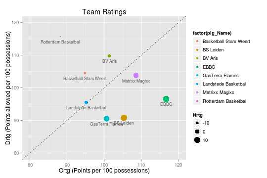
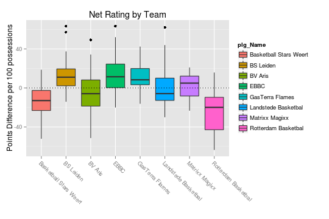
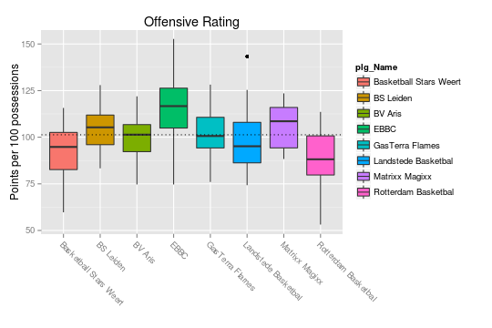
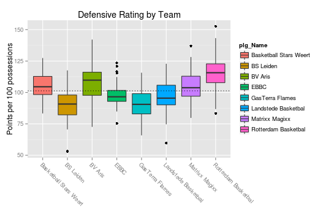
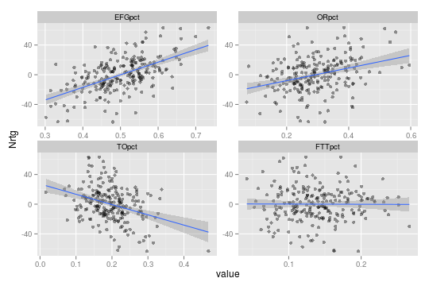

..
  Assumptions
  season      : srting identifier of the season we're evaluating
  regseasTeam : dataframe containing the team statistics
  ReportTeamRatings.r is sourced.

2011-2012 Regular season
====================================================

Teams
-----

The following teams are in this competition:

::

    ##   plg_ID               plg_Name
    ## 1   1771    Landstede Basketbal
    ## 2   2393         Matrixx Magixx
    ## 3   2571 Basketball Stars Weert
    ## 4   2823                   EBBC
    ## 5   3103    Rotterdam Basketbal
    ## 6   3107              BS Leiden
    ## 7   3138                BV Aris
    ## 8   8594        GasTerra Flames

Ratings
-------

    

    

    

    

Four Factors
------------

The net rating is plotted against all "four factors"" 
for all games in this competition.
These plots show us how each of the four factors influences the net rating.
Because we can assume the net rating to be the best indicator of actually winning games,
these plots show ho and how strongly each of the four factor contribute to winning basketball games in the DBL in this season. 

    

The correlation matrix for the four factors and the net rating is displayed below:

::

    ##             Nrtg   EFGpct    ORpct    TOpct    FTTpct
    ## Nrtg    1.000000  0.57096  0.33285 -0.34664 -0.004752
    ## EFGpct  0.570960  1.00000  0.03471 -0.13503 -0.047915
    ## ORpct   0.332854  0.03471  1.00000  0.08826 -0.056106
    ## TOpct  -0.346642 -0.13503  0.08826  1.00000  0.090040
    ## FTTpct -0.004752 -0.04792 -0.05611  0.09004  1.000000

