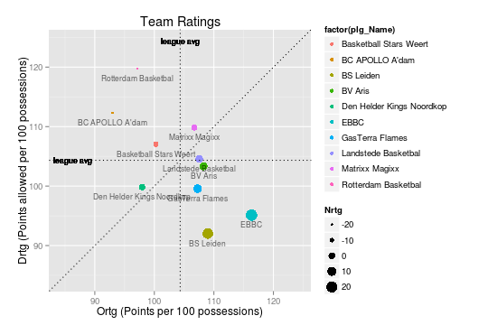

..
  Assumptions
  season      : srting identifier of the season we're evaluating
  regseasTeam : dataframe containing the team statistics
  ReportTeamRatings.r is sourced.

.. todo::

  Add a header:
  
   * date of last analyzed games
   * number of games analyzed
   * team summary should contain W/L, win pct, median Ortg, Drtg, Nrtg
   * format tables

2012-2013 Regular season
====================================================

Results
-------

The following teams are in this competition:

+----+---------------------------+------+-------+-------+--------+--------+--------+
|    | plg_Name                  | pct  | W     | L     | Nrtg   | Ortg   | Drtg   |
+====+===========================+======+=======+=======+========+========+========+
| 1  | EBBC                      | 0.83 | 30.00 | 6.00  | 22.76  | 119.10 | 93.63  |
+----+---------------------------+------+-------+-------+--------+--------+--------+
| 2  | BS Leiden                 | 0.75 | 27.00 | 9.00  | 15.10  | 105.97 | 93.10  |
+----+---------------------------+------+-------+-------+--------+--------+--------+
| 3  | GasTerra Flames           | 0.72 | 26.00 | 10.00 | 6.53   | 110.13 | 99.25  |
+----+---------------------------+------+-------+-------+--------+--------+--------+
| 4  | BV Aris                   | 0.56 | 20.00 | 16.00 | 5.76   | 108.77 | 104.58 |
+----+---------------------------+------+-------+-------+--------+--------+--------+
| 5  | Landstede Basketbal       | 0.53 | 19.00 | 17.00 | 3.15   | 107.91 | 104.77 |
+----+---------------------------+------+-------+-------+--------+--------+--------+
| 6  | Den Helder Kings Noordkop | 0.50 | 18.00 | 18.00 | -0.46  | 96.38  | 100.63 |
+----+---------------------------+------+-------+-------+--------+--------+--------+
| 7  | Matrixx Magixx            | 0.47 | 17.00 | 19.00 | -4.36  | 107.27 | 107.97 |
+----+---------------------------+------+-------+-------+--------+--------+--------+
| 8  | Basketball Stars Weert    | 0.44 | 16.00 | 20.00 | -4.25  | 98.12  | 107.64 |
+----+---------------------------+------+-------+-------+--------+--------+--------+
| 9  | BC APOLLO A'dam           | 0.11 | 4.00  | 32.00 | -18.53 | 91.78  | 111.95 |
+----+---------------------------+------+-------+-------+--------+--------+--------+
| 10 | Rotterdam Basketbal       | 0.08 | 3.00  | 33.00 | -21.68 | 97.98  | 118.20 |
+----+---------------------------+------+-------+-------+--------+--------+--------+

Ratings
-------

    

.. figure:: figure/net-rating.png
    :alt: 

    

.. figure:: figure/off-rating.png
    :alt: 

    

    

Four Factors
------------

The net rating is plotted against all "four factors"
for all games in this competition.
These plots show us how each of the four factors influences the net rating.
Because we can assume the net rating to be the best indicator of actually winning games,
these plots show how and how strongly each of the four factor contribute to winning basketball games in the DBL in this season. 

.. figure:: figure/net-rating-by-four-factor.png
    :alt: 

    

The correlation matrix for the four factors and the net rating is displayed below:

::

    ##           Nrtg   EFGpct  ORpct    TOpct  FTTpct
    ## Nrtg    1.0000  0.60587 0.4942 -0.22099 0.11939
    ## EFGpct  0.6059  1.00000 0.2064 -0.10716 0.01536
    ## ORpct   0.4942  0.20640 1.0000  0.12402 0.01910
    ## TOpct  -0.2210 -0.10716 0.1240  1.00000 0.03972
    ## FTTpct  0.1194  0.01536 0.0191  0.03972 1.00000

