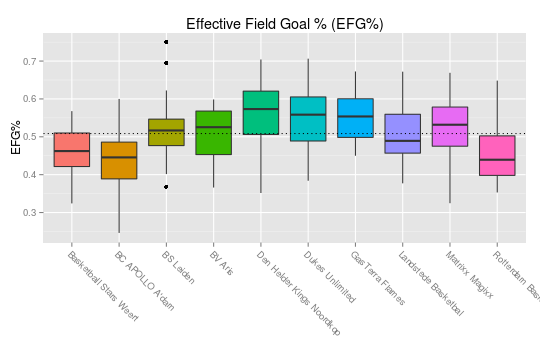

..
  Assumptions
  season      : srting identifier of the season we're evaluating
  regseasTeam : dataframe containing the team statistics
  ReportTeamRatings.r is sourced.

2013-2014 Regular season
====================================================

Results
-------

The following teams are in this competition:

+----+---------------------------+------+------+------+-----------+-----------+-----------+
|    | plg_Name                  | pct  | W    | L    | avg(Nrtg) | avg(Ortg) | avg(Drtg) |
+====+===========================+======+======+======+===========+===========+===========+
| 1  | Dukes Unlimited           | 1.00 | 3.00 | 0.00 | 20.42     | 107.52    | 87.10     |
+----+---------------------------+------+------+------+-----------+-----------+-----------+
| 2  | Landstede Basketbal       | 1.00 | 2.00 | 0.00 | 24.93     | 107.48    | 82.55     |
+----+---------------------------+------+------+------+-----------+-----------+-----------+
| 3  | BV Aris                   | 0.67 | 2.00 | 1.00 | 4.37      | 110.19    | 105.83    |
+----+---------------------------+------+------+------+-----------+-----------+-----------+
| 4  | Den Helder Kings Noordkop | 0.67 | 2.00 | 1.00 | 2.79      | 112.59    | 109.80    |
+----+---------------------------+------+------+------+-----------+-----------+-----------+
| 5  | BS Leiden                 | 0.50 | 2.00 | 2.00 | -1.19     | 98.50     | 99.69     |
+----+---------------------------+------+------+------+-----------+-----------+-----------+
| 6  | GasTerra Flames           | 0.50 | 2.00 | 2.00 | 7.84      | 96.70     | 88.85     |
+----+---------------------------+------+------+------+-----------+-----------+-----------+
| 7  | Matrixx Magixx            | 0.50 | 1.00 | 1.00 | 8.31      | 105.24    | 96.93     |
+----+---------------------------+------+------+------+-----------+-----------+-----------+
| 8  | Rotterdam Basketbal       | 0.50 | 1.00 | 1.00 | -3.97     | 113.90    | 117.87    |
+----+---------------------------+------+------+------+-----------+-----------+-----------+
| 9  | BC APOLLO A'dam           | 0.00 | 0.00 | 4.00 | -26.21    | 79.64     | 105.85    |
+----+---------------------------+------+------+------+-----------+-----------+-----------+
| 10 | Basketball Stars Weert    | 0.00 | 0.00 | 3.00 | -21.00    | 89.59     | 110.59    |
+----+---------------------------+------+------+------+-----------+-----------+-----------+

Ratings and Pace
----------------

::

    ## Warning: Removed 1 rows containing missing values (geom_point). Warning:
    ## Removed 1 rows containing missing values (geom_text).

.. figure:: figure/rating-quadrant.png
    :alt: 

    

.. figure:: figure/net-rating.png
    :alt: 

    

.. figure:: figure/off-rating.png
    :alt: 

    

.. figure:: figure/def-rating.png
    :alt: 

    

.. figure:: figure/pace-by-team.png
    :alt: 

    

Four Factors
------------

The net rating is plotted against all "four factors"
for all games in this competition.
These plots show us how each of the four factors influences the net rating.
Because we can assume the net rating to be the best indicator of actually winning games,
these plots show how and how strongly each of the four factors contribute to winning basketball games in the DBL in this season. 

.. figure:: figure/net-rating-by-four-factor.png
    :alt: 

    

The correlation matrix for the four factors and the net rating is displayed below:

::

    ##            Nrtg  EFGpct    ORpct    TOpct  FTTpct
    ## Nrtg    1.00000  0.3983  0.29144 -0.53304 0.02168
    ## EFGpct  0.39833  1.0000 -0.13209 -0.31574 0.16036
    ## ORpct   0.29144 -0.1321  1.00000  0.05453 0.05557
    ## TOpct  -0.53304 -0.3157  0.05453  1.00000 0.09109
    ## FTTpct  0.02168  0.1604  0.05557  0.09109 1.00000

By Team
^^^^^^^

    

.. figure:: figure/or-pct-by-team.png
    :alt: 

    

.. figure:: figure/to-pct-team.png
    :alt: 

    

.. figure:: figure/ftt-pct-team.png
    :alt: 

    

By Opponent
^^^^^^^^^^^

.. figure:: figure/opp-efg-by-team.png
    :alt: 

    

.. figure:: figure/opp-or-pct-by-team.png
    :alt: 

    

.. figure:: figure/opp-to-pct-team.png
    :alt: 

    

.. figure:: figure/opp-ftt-pct-team.png
    :alt: 

    

Points
------

.. figure:: figure/point-differential-by-team.png
    :alt: 

    

.. todo::

  Add a header:
  
   * date of last analyzed games
   * number of games analyzed
