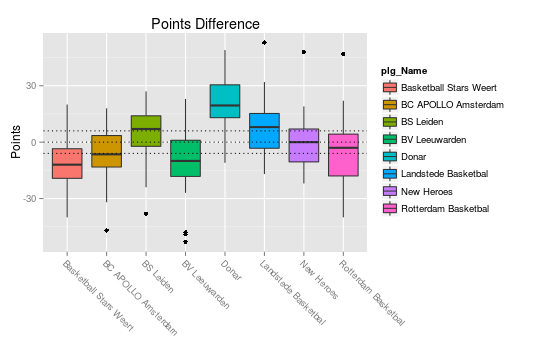

..
  Assumptions
  season      : srting identifier of the season we're evaluating
  regseasTeam : dataframe containing the team statistics
  ReportTeamRatings.r is sourced.

2016-2017 Regular season
====================================================

Results
-------

The following teams are in this competition:

+---+------------------------+------+-------+-------+-----------+-----------+-----------+
|   | plg_Name               | pct  | W     | L     | avg(Nrtg) | avg(Ortg) | avg(Drtg) |
+===+========================+======+=======+=======+===========+===========+===========+
| 1 | GasTerra Flames        | 0.94 | 17.00 | 1.00  | 27.05     | 110.62    | 83.56     |
+---+------------------------+------+-------+-------+-----------+-----------+-----------+
| 2 | Landstede Basketbal    | 0.72 | 13.00 | 5.00  | 9.87      | 104.79    | 94.92     |
+---+------------------------+------+-------+-------+-----------+-----------+-----------+
| 3 | BS Leiden              | 0.67 | 12.00 | 6.00  | 6.86      | 97.32     | 90.45     |
+---+------------------------+------+-------+-------+-----------+-----------+-----------+
| 4 | Dukes Unlimited        | 0.44 | 8.00  | 10.00 | -2.93     | 97.45     | 100.38    |
+---+------------------------+------+-------+-------+-----------+-----------+-----------+
| 5 | Rotterdam Basketbal    | 0.44 | 8.00  | 10.00 | -3.56     | 96.72     | 100.28    |
+---+------------------------+------+-------+-------+-----------+-----------+-----------+
| 6 | BC APOLLO A'dam        | 0.39 | 7.00  | 11.00 | -11.10    | 97.89     | 108.99    |
+---+------------------------+------+-------+-------+-----------+-----------+-----------+
| 7 | BV Leeuwarden          | 0.33 | 6.00  | 12.00 | -10.85    | 97.69     | 108.55    |
+---+------------------------+------+-------+-------+-----------+-----------+-----------+
| 8 | Basketball Stars Weert | 0.06 | 1.00  | 17.00 | -15.35    | 90.79     | 106.14    |
+---+------------------------+------+-------+-------+-----------+-----------+-----------+

Ratings
-------

The average offensive and defensive ratings for all teams are pictured below,
in the quadrant plot descibed by Kevin Pelton in [Pelton2012]_.

.. figure:: figure/rating-quadrant-1.png
    :alt: 

    

.. figure:: figure/net-rating-1.png
    :alt: 

    

.. figure:: figure/off-rating-1.png
    :alt: 

    

.. figure:: figure/def-rating-1.png
    :alt: 

    

Pace
----

.. figure:: figure/pace-by-team-1.png
    :alt: 

    

Points
------

    

Four Factors
------------

The net rating is plotted against all "four factors"
for all games in this competition.
These plots show us how each of the four factors influences the net rating.
Because we can assume the net rating to be the best indicator of actually winning games,
these plots show how and how strongly each of the four factors contribute to winning basketball games in the DBL in this season. 

.. figure:: figure/net-rating-by-four-factor-1.png
    :alt: 

    

The correlation matrix for the four factors and the net rating is displayed below:

::

    ##              Nrtg      EFGpct      ORpct       TOpct       FT4f
    ## Nrtg    1.0000000  0.61696536 0.44026047 -0.23344005 0.17942079
    ## EFGpct  0.6169654  1.00000000 0.14626589 -0.12203681 0.01720662
    ## ORpct   0.4402605  0.14626589 1.00000000  0.05281708 0.18837304
    ## TOpct  -0.2334401 -0.12203681 0.05281708  1.00000000 0.14891688
    ## FT4f    0.1794208  0.01720662 0.18837304  0.14891688 1.00000000

Offense
^^^^^^^

This shows the four factors for each of the teams.

.. figure:: figure/efg-by-team-1.png
    :alt: 

    

.. figure:: figure/or-pct-by-team-1.png
    :alt: 

    

.. figure:: figure/to-pct-team-1.png
    :alt: 

    

.. figure:: figure/ftt-pct-team-1.png
    :alt: 

    

Defense
^^^^^^^

This shows the four factors of the team's opponents for each of the teams.

.. figure:: figure/opp-efg-by-team-1.png
    :alt: 

    

.. figure:: figure/opp-or-pct-by-team-1.png
    :alt: 

    

.. figure:: figure/opp-to-pct-team-1.png
    :alt: 

    

.. figure:: figure/opp-ftt-pct-team-1.png
    :alt: 

    

Shot selection
--------------

.. figure:: figure/shot-selection-ftt-team-1.png
    :alt: 

    

.. figure:: figure/shot-selection-2s-team-1.png
    :alt: 

    

.. figure:: figure/shot-selection-3s-team-1.png
    :alt: 

    

.. figure:: figure/shot-selection-history-team-1.png
    :alt: 

    

.. todo::

  Add a header:
  
   * date of last analyzed games
   * number of games analyzed
